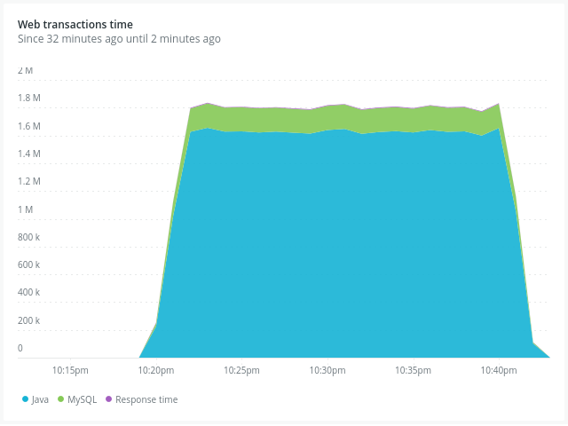
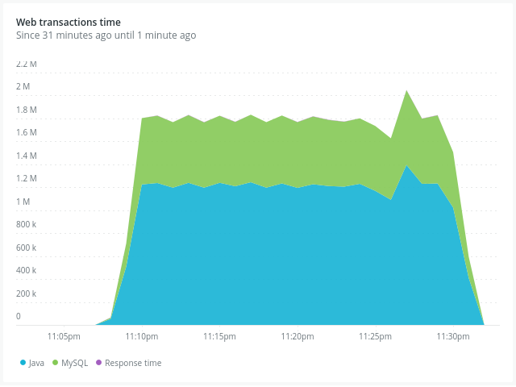
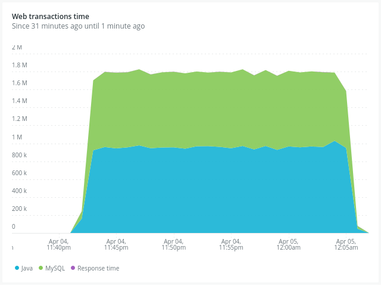
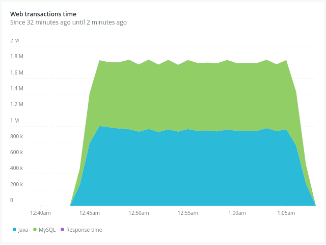

# Pool de Conexiones - Transacciones Entre Dos Cuentas

## Información de la actividad
- **Universidad:** Universidad de La Sabana  
- **Facultad:** Facultad de Ingeniería  
- **Materia:** Patrones Arquitectónicos Avanzados 
- **Profesor:** Daniel Orlando Saavedra Fonnegra

## Integrantes del Proyecto
| Nombre | Correo Electrónico |
|--------|-------------------|
| Juan David Cetina Gómez | juancego@unisabana.edu.co |
| Ana Lucía Quintero Vargas | anaquiva@unisabana.edu.co |

## Estructura de la Documentación
- [1. Introducción](#1-introducción)
- [2. Metodología](#2-metodología)
- [3. Análisis y Resultados](#3-análisis-y-resultados)
- [4. Conclusión](#4-conclusión)
- [5. Referencias](#5-referencias)

---

## 1. Introducción

El propósito principal de este proyecto fue analizar cómo se comporta una aplicación cuando muchos usuarios realizan operaciones al mismo tiempo. Para ello, se diseñó una simulación bancaria donde dos cuentas pueden enviarse dinero entre sí. Lo interesante del ejercicio fue que, aunque la lógica era sencilla, se realizó un énfasis en entender cómo el sistema respondía bajo presión, especialmente al cambiar la cantidad de conexiones activas entre la aplicación y la base de datos.

Se utilizó Java con Spring Boot para desarrollar la aplicación, y una base de datos en la nube para guardar la información [1]. Además, se incluyeron mecanismos como el control de concurrencia optimista y los reintentos automáticos para manejar situaciones en las que dos transacciones intentan modificar los mismos datos simultáneamente, lo cual es posible gracias a funcionalidades del framework JPA y la anotación @Retryable [1].

El desempeño del sistema se midió usando dos herramientas: Apache JMeter, que simula múltiples usuarios enviando transacciones al mismo tiempo, y New Relic, que permite monitorear en tiempo real qué tanto tarda cada parte del sistema en responder [2]. Con esto se probaron diferentes configuraciones del número de conexiones posibles, desde muy pocas hasta muchas, para identificar cuál es la más eficiente en un escenario de alta concurrencia.

---

## 2. Metodología

<p align="justify">
Con el fin de evaluar el comportamiento concurrente de una API REST desarrollada en Spring Boot, se diseñó una práctica centrada en probar cómo distintas configuraciones del pool de conexiones HikariCP afectaban la interacción entre el backend Java y una base de datos remota alojada en Railway. El enfoque principal fue observar, mediante pruebas de carga, cómo se distribuían los tiempos de respuesta entre la lógica de la aplicación y el acceso a la base de datos, bajo diferentes escenarios de concurrencia.

Para ello, se generó un proyecto base utilizando Spring Initializr, en el cual se implementaron las entidades necesarias (cuentas y transacciones), junto con sus respectivos DTOs, repositorios JPA, entidades ORM y controladores REST. Por un lado, la tabla de cuentas contenía columnas para id (autogenerada), monto y un campo adicional service añadido para gestionar correctamente accesos simultáneos. Para resolver posibles conflictos al modificar datos compartidos entre múltiples hilos, se implementó control de concurrencia optimista mediante el uso de una anotación @Version, que permite a JPA detectar si otra transacción ha modificado el mismo registro en paralelo y, en caso de conflicto, lanzar una excepción.

Dicho manejo se complementó con la anotación @Retryable, la cual se configuró para que, en caso de que se lanzara una OptimisticLockException, el intento de operación se reintentara hasta tres veces, con una espera de 100 ms entre cada intento. Este mecanismo se aplicó específicamente sobre el método responsable de mover dinero entre cuentas, el cual se mantuvo anotado con @Transactional para asegurar la atomicidad de cada operación. Esta estrategia busca evitar soluciones más forzadas o restrictivas como el uso de synchronized, ofreciendo un control más flexible y desacoplado del entorno multihilo.

Por otro lado, la tabla de transacciones incluía los campos id, origen_id, destino_id, monto y timestamp, representando cada operación entre dos cuentas. La estructura de la base de datos fue generada automáticamente gracias a la configuración ddl-auto: update de Spring Data JPA, lo cual permitió crear y actualizar las tablas sin necesidad de scripts SQL manuales.

En cuanto a la funcionalidad expuesta por la API, se creó un endpoint que permitía inicializar dos cuentas con un monto de 10,000 pesos cada una, y otro que permitía listar todas las cuentas existentes. Estas operaciones fueron clave para monitorear los cambios de saldo durante las pruebas de concurrencia.

Para realizar el monitoreo en tiempo real del rendimiento, se integró la aplicación con la plataforma New Relic. Se completaron los pasos de instalación de logs, agente de infraestructura y agente Java, configurando el archivo de New Relic para que identificara la aplicación, el cual tenía el nombre de “banco”. Posteriormente, la aplicación se ejecutó localmente a través de un comando que incorporaba el agente, permitiendo que los datos de desempeño se enviaran directamente a la plataforma de monitoreo:
</p>

```
& "C:\Program Files\Java\jdk-17\bin\java.exe" -javaagent:"C:\Users\analu\Downloads\banco\banco\newrelic\newrelic.jar" -jar "build\libs\banco-0.0.1-SNAPSHOT.jar"
```
<p align="justify">
Las pruebas de carga se ejecutaron utilizando Apache JMeter con 30 hilos concurrentes. Inicialmente se estableció un número finito de repeticiones, pero al no alcanzar los resultados esperados, se optó por usar un bucle infinito en los hilos. A partir de ahí, se monitoreó manualmente la evolución de los saldos, verificando que las transacciones se ejecutaran correctamente hasta que una cuenta llegara a cero y la otra a 20,000 pesos.

Para el análisis de rendimiento, se probaron cuatro configuraciones distintas del pool de conexiones HikariCP: básica, intermedia, agresiva y muy agresiva. Todas compartían los mismos valores de idleTimeout (30,000 ms), maxLifetime (1,800,000 ms) y connectionTimeout (30,000 ms), parámetros que se mantuvieron constantes para que las diferencias observadas se debieran únicamente a la variación en el tamaño del pool. En este sentido, idleTimeout definía cuánto tiempo puede permanecer inactiva una conexión antes de cerrarse, mientras que maxLifetime establecía el tiempo máximo que puede vivir una conexión antes de ser reemplazada, evitando problemas con conexiones viejas o poco confiables. Por su parte, connectionTimeout marcaba cuánto tiempo máximo puede esperar una solicitud por una conexión libre.

En cuanto a los parámetros variables, maximum-pool-size y minimum-idle, se definieron en cuatro niveles: 5-2 (básica), 20-5 (intermedia), 50-20 (agresiva) y 80-40 (muy agresiva). Estos valores fueron seleccionados estratégicamente para representar distintos grados de disponibilidad de conexiones ante la carga concurrente generada por los 30 hilos activos de JMeter. La configuración básica, con un máximo de 5 conexiones y solo 2 en estado inactivo, fue pensada para simular un sistema con recursos limitados, en el que se espera cierto grado de contención. La configuración intermedia amplió estos valores a 20-5, buscando un equilibrio más razonable entre disponibilidad y consumo de recursos. En la configuración agresiva (50-20), se permitió un margen mucho mayor para atender múltiples solicitudes concurrentes sin generar tiempos de espera elevados, ideal para analizar el desempeño en un escenario más exigente. Finalmente, la configuración muy agresiva (80-40) se planteó como un límite superior, incluso mayor al número de usuarios concurrentes, con el fin de verificar si un aumento significativo en las conexiones disponibles se traducía realmente en mejoras perceptibles en los tiempos de respuesta o si, por el contrario, implicaba un uso innecesario de recursos.
</p>

---

## 3. Análisis y Resultados

A continuación, en las gráficas de las Figuras 1, 2, 3 y 4 se observan el comportamiento de los tiempos de respuesta durante una carga concurrente generada por JMeter, donde cada hilo ejecuta múltiples transacciones POST hacia el backend. En este caso, se configuró para que en todas las configuraciones desde el JMeter se tengan 30 usuarios (hilos) con un período de arranque (Ramp-up period) de 1 segundo para realizar de manera adecuada los test de concurrencia.

En cada gráfica se puede observar que las áreas coloreadas representan el tiempo consumido por la aplicación Java (azul) y por la base de datos MySQL (verde), permitiendo analizar la distribución del tiempo de procesamiento y el impacto de cada configuración.

###  Pool con Configuración Básica



*Figura 1. Visualización del tiempo de transacción web obtenida desde New Relic con una configuración básica de HikariCP, con un maximumPoolSize de 5 y un minimumIdle de 2.*

En esta gráfica se ve que la mayoría del tiempo lo consume la aplicación en Java. Esto indica que hay muchas operaciones esperando una conexión disponible, lo que genera un cuello de botella en el backend. El sistema no es capaz de atender bien a los 30 usuarios simultáneos.
### Pool con Configuración Intermedia



*Figura 2. Visualización del tiempo de transacción web obtenida desde New Relic con una configuración intermedia de HikariCP, con un maximumPoolSize de 20 y un minimumIdle de 5.*

En esta prueba se evidencia una mejora significativa en los tiempos del backend. Aunque la base de datos comenzó a asumir una proporción mayor del tiempo de respuesta, Java continuó siendo el componente más exigido, aunque en menor medida que en la configuración básica.


### Pool con Configuración Agresiva



*Figura 3. Visualización del tiempo de transacción web obtenida desde New Relic con una configuración agresiva de HikariCP, estableciendo un maximumPoolSize de 50 y un minimumIdle de 20.*

En este caso se observó una reducción considerable en los tiempos del backend, y un incremento progresivo en el peso relativo de la base de datos en el tiempo total de transacción. Si bien la carga se distribuyó mejor, Java seguía teniendo un rol predominante, lo cual motivó la necesidad de evaluar una configuración aún más exigente.


### Pool con Configuración Muy Agresiva



*Figura 4. Visualización del tiempo de transacción web obtenida desde New Relic bajo una configuración muy agresiva de HikariCP, con un maximumPoolSize de 80 y un minimumIdle de 40.*

En este caso, la aplicación tiene suficientes conexiones para atender a todos los usuarios sin demoras. Sin embargo, se observa que el tiempo de respuesta total ya no mejora mucho con respecto a la configuración anterior. Incluso, puede notarse que se empieza a desperdiciar recursos, porque se asignan más conexiones de las necesarias. A diferencia de las pruebas anteriores, se buscó identificar un punto donde MySQL empezara a tener un rol más dominante, reduciendo la presión sobre Java.


Con base en las comparaciones anteriormente expuestas, se puede concluir que aumentar el número de conexiones disponibles mejora el desempeño hasta cierto punto. Sin embargo, después de un nivel intermedio, los beneficios adicionales son mínimos y pueden generar un consumo innecesario de recursos. Por eso, encontrar una configuración equilibrada (como la intermedia o agresiva) es lo más recomendable para un sistema como este.

---

## 4. Conclusión

Este proyecto permitió entender y observar cómo el número de conexiones disponibles entre una aplicación y su base de datos influye directamente en el rendimiento general del sistema de la misma aplicación. Se comprobó que cuando hay pocas conexiones, el sistema se vuelve lento y no puede atender correctamente a muchos usuarios. Por lo que al aumentar ese número se mejoran los tiempos de respuesta y se reducen los bloqueos, aunque solo hasta cierto punto.

También se implementaron estrategias para manejar posibles conflictos cuando varias operaciones intentaban modificar los mismos datos, lo cual evitó errores y garantizó que cada transacción fuera segura. Estas decisiones ayudaron a construir una solución confiable para ambientes concurrentes.

Finalmente, el uso de herramientas de monitoreo y pruebas permitió identificar de manera visual y precisa cómo responde el sistema ante diferentes niveles de carga, donde se realizan ciertas comparaciones en cuanto a las gráficas de los tiempos de los tamaños de los Pool, lo que ayuda a ver de una mejor manera el comportamiento de la aplicación cuando existen diferentes niveles de concurrencia.


---

## 5. Referencias

[1] Spring, “Spring Framework Documentation.” [Online]. Available: https://docs.spring.io/spring-framework/

[2] New Relic, “New Relic Documentation.” [Online]. Available: https://docs.newrelic.com/
